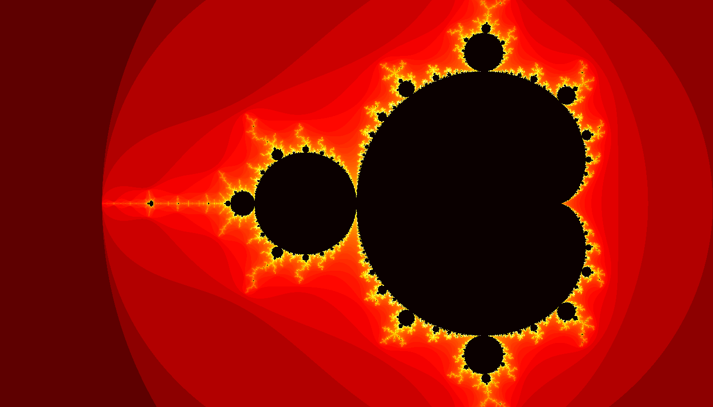

# DuckBrot 🦆🌀

**Because why benchmark with boring aggregates when you can generate fractals?**

This project uses recursive CTEs to calculate the Mandelbrot set entirely in SQL — no loops, no procedural code, just pure SQL. It serves as a fun and visually appealing benchmark for testing recursive query performance, floating-point precision, and computational capabilities of SQL engines.



## 🎯 What is This?

A benchmark suite that:
- Computes the famous [Mandelbrot set](https://en.wikipedia.org/wiki/Mandelbrot_set) using SQL recursive CTEs
- Tests multiple SQL engines and programming languages
- Generates beautiful fractal images as proof of computation
- Reveals which database renders infinity fastest

## 🚀 Quick Start

```bash
# Clone the repository
git clone https://github.com/yourusername/duckbrot.git
cd duckbrot

# Install dependencies
pip install -r requirements.txt

# Run the benchmark suite
python main.py
```

## 📊 Benchmark Results

Current results on 1400x800 pixels, 256 max iterations:

| Engine/Implementation | Time (ms) | Relative Performance |
|----------------------|-----------|---------------------|
| DuckDB (SQL)         | 1,375 ms  | 1.00x (baseline)    |
| Pure Python          | 4,043 ms  | 2.94x slower        |

**Winner: DuckDB SQL is ~3x faster than pure Python!**

## 🎨 How It Works

The Mandelbrot set is computed by iterating the formula `z = z² + c` for each pixel in the complex plane:

```sql
WITH RECURSIVE
  -- Generate pixel grid and map to complex plane
  pixels AS (
    SELECT
      x, y,
      -2.5 + (x * 3.5 / width) AS cx,
      -1.0 + (y * 2.0 / height) AS cy
    FROM generate_series(0, width-1) AS x,
         generate_series(0, height-1) AS y
  ),
  -- Recursively iterate z = z² + c
  mandelbrot_iterations AS (
    SELECT x, y, cx, cy, 0.0 AS zx, 0.0 AS zy, 0 AS iteration
    FROM pixels

    UNION ALL

    SELECT
      x, y, cx, cy,
      zx * zx - zy * zy + cx AS zx,
      2.0 * zx * zy + cy AS zy,
      iteration + 1
    FROM mandelbrot_iterations
    WHERE iteration < max_iterations
      AND (zx * zx + zy * zy) <= 4.0
  )
SELECT x, y, MAX(iteration) AS depth
FROM mandelbrot_iterations
GROUP BY x, y;
```

The iteration count determines the color of each pixel, creating the iconic fractal pattern.

## 📁 Project Structure

```
duckbrot/
├── main.py              # Benchmark orchestrator
├── duckbrot.py          # DuckDB SQL implementation
├── pybrot.py            # Pure Python reference implementation
├── utils.py             # Shared utilities (image generation, timing, etc.)
├── requirements.txt     # Python dependencies
├── LICENSE              # MIT License
├── README.md            # This file
└── images/              # Generated fractal images
    ├── duckbrot.png
    └── pybrot.png
```

## 🔧 Adding New Benchmarks

Want to test PostgreSQL, MySQL, or SQLite? Just:

1. Create a new file (e.g., `postgresqlbrot.py`)
2. Implement a `run_postgresqlbrot(width, height, max_iterations)` function
3. Add one line to `main.py`:
   ```python
   BENCHMARKS = [
       ("DuckDB (SQL)", "duckbrot", "run_duckbrot"),
       ("Pure Python", "pybrot", "run_pybrot"),
       ("PostgreSQL", "postgresqlbrot", "run_postgresqlbrot"),  # New!
   ]
   ```

The framework handles everything else automatically!

## 🎯 Configuration

Adjust the benchmark parameters in `main.py`:

```python
WIDTH = 1400           # Image width in pixels
HEIGHT = 800           # Image height in pixels
MAX_ITERATIONS = 256   # Maximum recursion depth
```

Higher values = more detail, longer computation time.

## 🐛 Known Engine Compatibility

### ✅ Works Great
- **DuckDB** - Excellent performance, proper DOUBLE precision
- **Pure Python** - Reference implementation

### 🔄 Should Work (untested)
- PostgreSQL (with proper recursive CTE support)
- SQLite (may need query adjustments)

### ⚠️ Known Issues
- Some engines don't support DOUBLE precision and may use DECIMAL
- Watch out for type inference - explicit `::DOUBLE` casts are critical!

## 🎓 What This Tests

This benchmark evaluates:
1. **Recursive CTE Performance** - How efficiently engines handle deep recursion
2. **Floating-Point Precision** - DOUBLE vs DECIMAL arithmetic accuracy
3. **Query Optimization** - How well engines optimize complex recursive queries
4. **Scalability** - Performance with increasing iterations and resolution

## 🤝 Contributing

Contributions welcome! Especially:
- New SQL engine implementations (PostgreSQL, MySQL, SQLite, etc.)
- Performance optimizations
- Better visualization options
- Benchmark result submissions

## 📜 License

MIT License - See [LICENSE](LICENSE) file for details.

## 🙏 Credits

Created by Thomas Zeutschler

Inspired by the mathematical beauty of the Mandelbrot set and curiosity about SQL engine performance.

## 🔗 Learn More

- [Mandelbrot Set (Wikipedia)](https://en.wikipedia.org/wiki/Mandelbrot_set)
- [SQL Recursive CTEs](https://en.wikipedia.org/wiki/Hierarchical_and_recursive_queries_in_SQL)
- [DuckDB](https://duckdb.org/)

---

**Curious which database renders infinity fastest? Clone and find out! 🌀**
